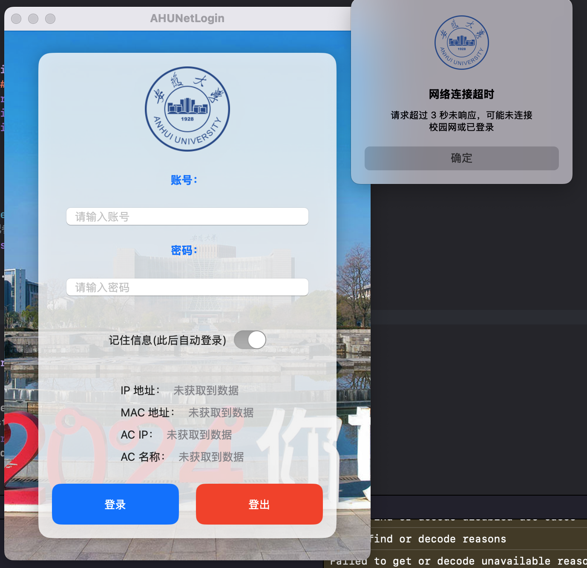
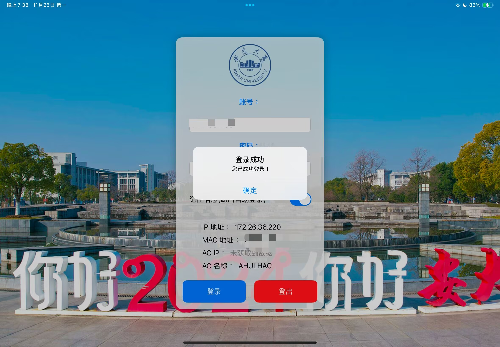

# AHU-Netlogin-SwiftUI

<h2 align="center">AHU NET Client SwiftUI</h2>
<h3 align="center">安徽大学(AHU)校园网(drcom认证)登录应用</h3>
<h3 align="center">使用SwiftUI构建</h3>

## 功能
- 登录
- 登出
- 保存账号密码
- 网络类型检测(不同网络请求方式不同)

## 演示
### MacOS

### iPadOS

iPhone和剩下的由于没设备+懒得下模拟器就不测试了，理论上你自己编译下都能用

## 原理
模拟发送网页登录请求进行登录登出功能

## TODO
- 自动登录